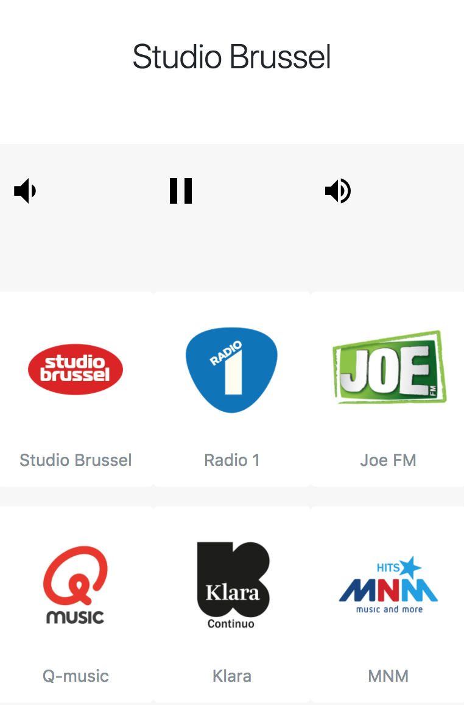

# rpi-radio
This app runs a docker based headless radio player on the pi that can be remote-controlled by any smarthphone/pc. Audio is output to /dev/snd, so you need to make sure the docker container has access to it (see examples). This allows the host system to play back the audio.

This docker container image leverages mpd under the hood and is written in nodejs.

### Screenshots

### Prerequisites
- a raspberry pi (tested on RPi2)
- docker (install with `curl -sSL https://get.docker.com | sh`)
### Examples
- `docker run -d --device=/dev/snd:/dev/snd --net=host svanscho/rpi-radio`

If you want the container to always run (even when the RPi rebooted):
- `docker run -d --restart=always --device=/dev/snd:/dev/snd --net=host svanscho/rpi-radio` (mind the **--restart=always**)